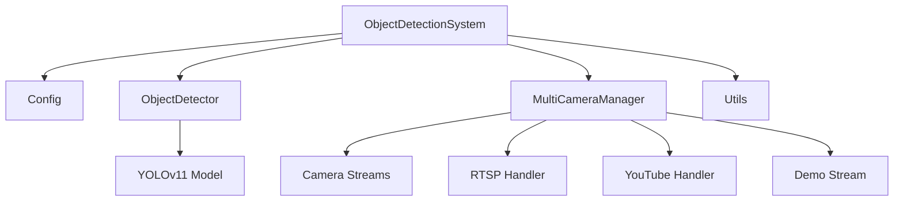
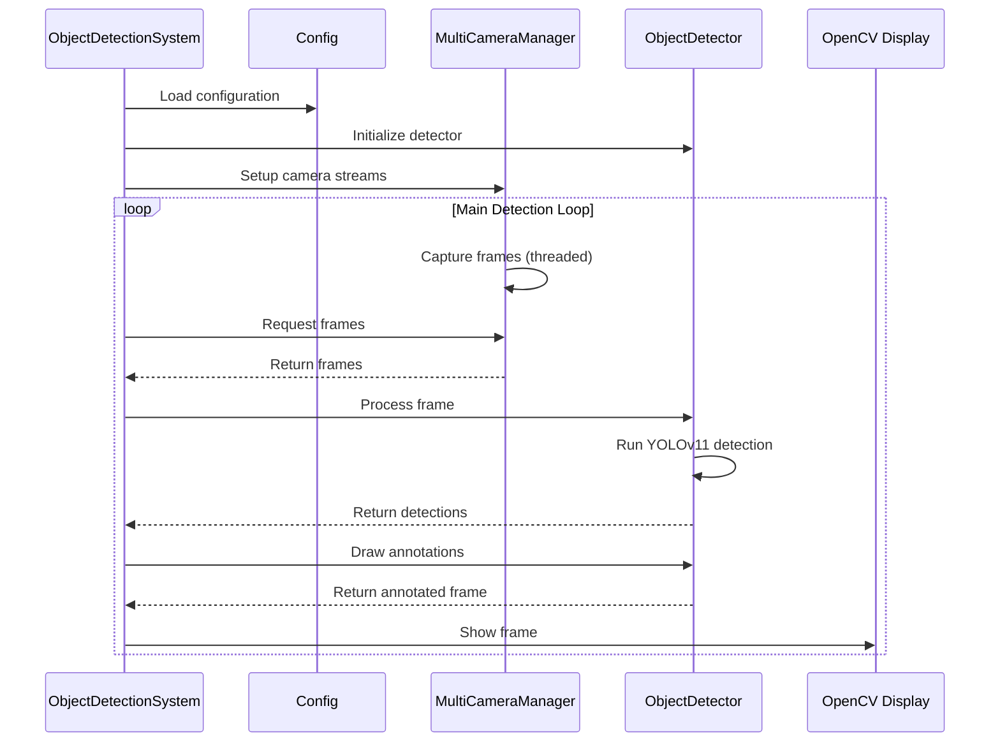

# Object Detection System Analysis

## System Overview

This is a real-time object detection system built with Python, OpenCV, and YOLOv11. The system is designed to process video streams from multiple camera sources simultaneously, perform object detection using state-of-the-art AI models, and provide rich visualizations with tracking and analytics capabilities.

## Architecture

The system follows a modular architecture with clearly defined components:

### Main Components

1. **ObjectDetectionSystem** (`main_object_detection.py`)
   - Main orchestrator that initializes and runs the entire system
   - Handles the main detection loop and user interactions
   - Manages system shutdown and resource cleanup

2. **Config** (`config.py`)
   - Centralized configuration management using environment variables
   - Defines model paths, camera settings, display options, and feature toggles
   - Handles zone and line configurations for object tracking

3. **ObjectDetector** (`detector/object_detector.py`)
   - Core detection logic using YOLOv11 models
   - Supports both PyTorch and TensorRT model formats
   - Implements object tracking, annotation, and visualization features

4. **MultiCameraManager & CameraStream** (`camera_stream.py`)
   - Manages multiple camera streams with thread-safe operation
   - Supports local cameras, RTSP streams, YouTube videos, and demo mode
   - Implements robust error handling and automatic reconnection for RTSP streams

5. **Utils** (`utils.py`)
   - Collection of utility functions for system support
   - Includes YouTube stream handling, system diagnostics, and testing utilities

## Data Flow

## Key Design Patterns

1. **Modular Architecture**: Clear separation of concerns with dedicated modules for each functionality
2. **Configuration-Driven Design**: Behavior controlled through environment variables for easy customization
3. **Thread-Safe Design**: Multi-threaded camera capture with queue-based communication
4. **Error Handling and Recovery**: Automatic reconnection and graceful degradation mechanisms
5. **Factory Pattern**: MultiCameraManager acts as a factory for different camera stream types
6. **Observer Pattern**: Callback mechanisms in inference slicer implementation
7. **Strategy Pattern**: Configurable detection strategies (sliced vs. full-frame)

## Capabilities

1. **Multi-Camera Support**: Process multiple camera streams simultaneously
2. **Real-time Object Detection**: Using YOLOv11 for fast, accurate detection
3. **Model Flexibility**: Supports PyTorch and TensorRT models with automatic fallback
4. **Object Tracking**: Implements ByteTrack for persistent object identification
5. **Zone Detection**: Polygon zones for entry/exit monitoring and line zones for counting
6. **Rich Visualization**: Bounding boxes, labels, tracking IDs, heatmap, and traces
7. **Performance Optimization**: Sliced inference and GPU acceleration support
8. **Robust Streaming**: Handles RTSP stream reconnection and error recovery

## Limitations

1. **Resource Intensive**: Can be CPU/GPU intensive with multiple cameras
2. **Network Dependency**: Requires stable connections for RTSP/YouTube streams
3. **Model Dependencies**: Requires downloading YOLOv11 models
4. **Limited Camera Calibration**: No explicit distortion correction
5. **Inference Throughput**: Limited by model processing speed